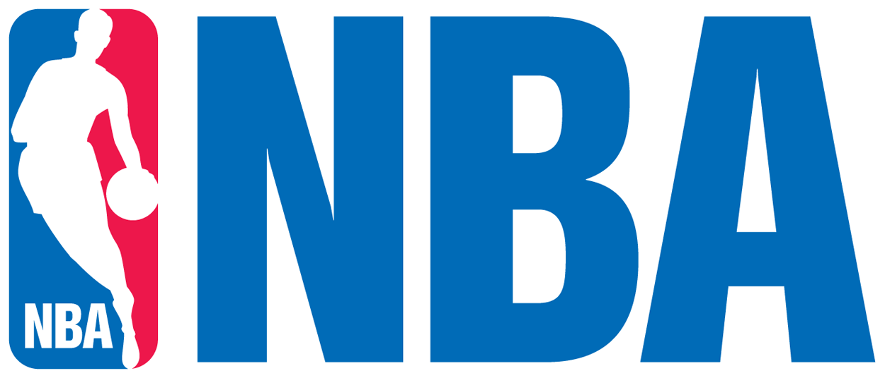

# NBA 2022-23 WorkFlow & WorkPlan

The intent of this project is to scrape the information for the players during the 2022-23 season from the NBA database and use it to build a webapplication called *NBADex*. This dashboard may be used in two different ways. 

First it will provide players information such as name, height, weight, field goals, three pointers, free throws, etc so the user can visualize the data as well as compare two players. In the single player view, there will be a Shot Chart where the user can visualize the accuracy and prefered shot type for each player. 

Second it will provide a more detailed view of the season by clustering the players into different groups based on their statistics. The clusters will be implemented using different Machine Learning unsupervised algorithms and the results will be visualized in a dashboard. 

It will have four main features:
1. Single player statistical description containing:
   1. Player's bios (name, height, weight, etc.)
   2. Player's shooting statistics shown in a shot chart
   3. Player's overall statistics shown in a radar chart
   4. Player's polygonal area for each radar chart
2. Player-to-player comparison containing:
   1. Player's bios (name, height, weight, etc.)
   2. Player's overall statistics shown in comparative radar charts
   3. Player's polygonal area for each radar chart
3. Clustering of NBA players for the season containing:
   1. Main clusters and some players inside each one of them
   2. Features most important for each cluster
   3. Descriptive analysis of the features and clusters and what it meant for the season
4. Overall view of the season
   1. Descriptive analysis of the season with some boxplots

## Step-by-step

### NBA Players Clustering
1. Get the data from the NBA API
   1. Download statistical 
   2. Download bios data
   3. Merge the statistical and bios data into a single dataframe
2. Clean the data
   1. Fill-out NAs
   2. Drop unnecessary columns
   3. Rename columns
   4. Change data types
   5. Add new columns as needed
3. Analyze the data
   1. Create some hypothesis to be tested
   2. Visualize the data summary statistics
   3. Visualize the data distribution for some variables
   4. Visualize the data correlation for some variables
4. Prepare the dataset for the clustering model
   1. Feature engineering
   2. Feature selection
   3. Feature transformation
5. Implement unsupervised Machine Learning lagorithms
   1. PCA
   2. K-Means
   3. Hierarchical Clustering
   4. DBSCAN
6. Evaluate the models
   1. Silhouete Score and Silhouete Charts
7. Hyperparameter fine-tuning
8. Show the clustering results in a dashboard (NBADex)

### Players ShotCharts

1. Get the data from the NBA API
   1. Download shooting data
   2. Download bios data
   3. Download player's images
   4. Merge the shooting and bio data into a single dataframe
2. Clean the data
   1. Fill-out NAs
   2. Drop unnecessary columns
   3. Rename columns
   4. Change data types
   5. Add new columns as needed
3. Analyse the data
   1. Visualize the summary statistics
   2. Plot the shooting data into a shot chart
4. Show the shot charts inside the Single Player view of the dashboard

